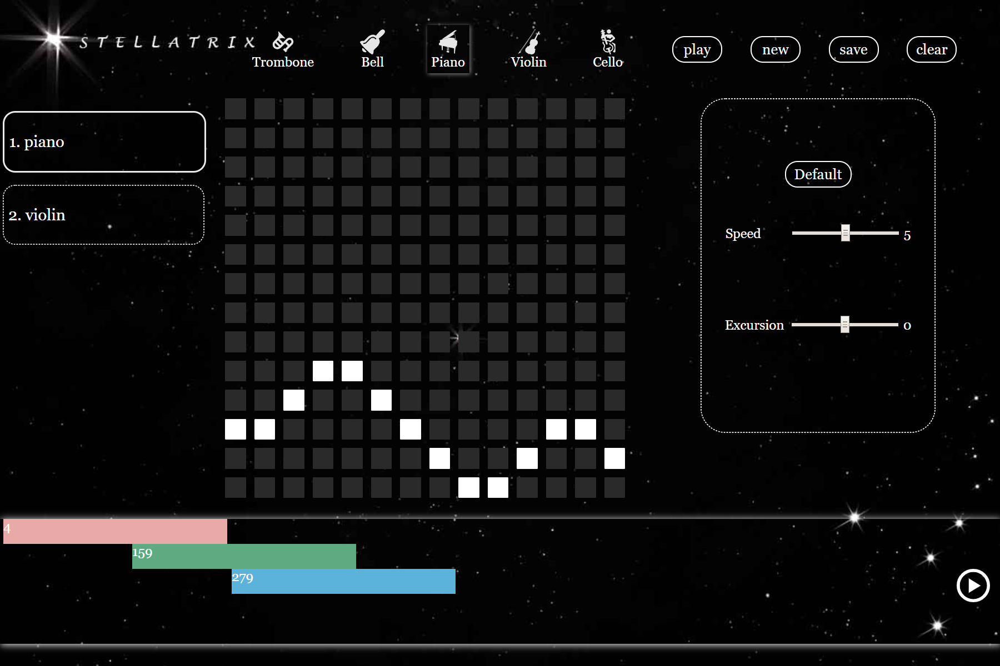

# Stellatrix 星筝

**Stellatrix ['stelətrɪks]**

**星筝(xīng zhēng)**

which is created from `stellar` and `matrix`.

## Description

A  **web musical creation application** written in **functional programming language JavaScript** that lets users create splendid music easily by just pressing tiles on a matrix and combining different melodies.

一个使用JavaScript函数式编程构建的Web音乐创作应用，让使用者通过按下矩形方块和组合不同旋律来轻松创作美妙的音乐。

We will provide several musical instruments to help you make your own melody and even your own symphony.

我们将会提供一些乐器（素材）来帮助你制作你自己的旋律，甚至是交响乐。

The project is written in `JavaScript` and uses helpful `sound` libraries of `Source`. 

这个项目使用`JavaScript`编写，并且会使用一些`Source`语言中有用的`sound`库。

+ Easy: Everyone can learn to use it without any guide
+ Light: You don’t need anything but a browser
+ Splendid: Make splendid music in simple steps.

## Artefact

In the upper part, there are some instruments to choose. You can use each of them to make a melody.

In the middle part, there is a matrix whose tiles when pressed transform from dark to light. Different combinations of light and dark tiles will make different melodies.

After you make a melody, you can save it so that you can apply it into your music.

In the lower part, you can freely change the order and duration of your pieces of melody in the music timeline.

## Contributors

[HarryShaunWang](https://github.com/HarryShaunWang)

[BogerHuman](https://github.com/BogerHuman)

[LucyShawYang](https://github.com/LucyShawYang)